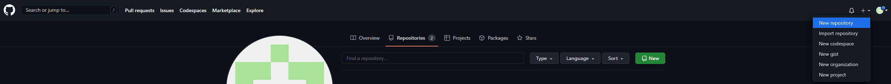
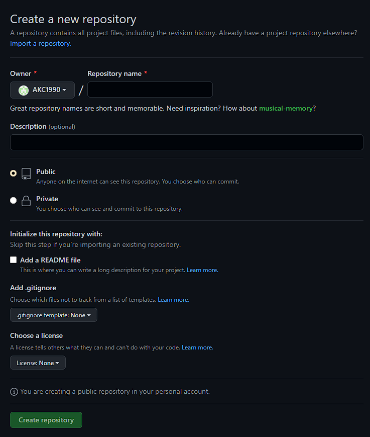
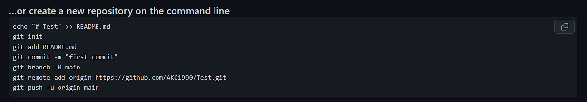
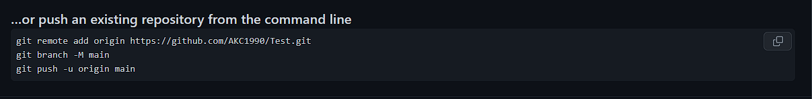
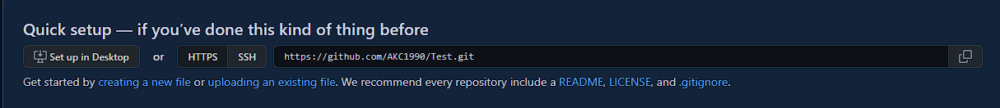

# Конспект по использованию системы контроля версий Git и удаленного репозитория на GitHub.com

## Система контроля версий Git
Git — это способ хранения файлов и их версий. Он позволяет смотреть историю изменений файлов, кто какие дополнения и когда вносил, как развивался проект, кто что в него добавлял и почему.

### 1. Начало работы

Перед началом работы с Git нужно последовательно указать следующие комманды:

**git config --global user.name _"Your Name"_** - указание Вашего имени для отображения автора коммитов
**git config --global user.email "Your email"**  - указание Вашей почты для связи с другими участниками проекта

### 2. Основные комманды

**git init** - инициализация удаленного репозитория в указанной папке

**git add "file_name"** или **"git add ."** - добавление для отслеживания изменений определенного файла или всего содержимого папки (ОБЯЗАТЕЛЬНО убедитесь, что Вы сохранили изменения в файле)

**git commit -m _"Your text"_** - фиксация изменений в локальном репозитории. В кавычках указывается текст с пояснениями изменений в файлах.

### 3. Комманды для контроля версий

**git status** - информация о состоянии репозитория (отслеживаемые, новые или измененные файлы)

**git diff** - информация о различиях между текущей версией репозитория и последней сохраненной версией(commit)

**git log** - информация из журнала изменений о всех ранее сохраненных версиях (commit) и их авторах

**git checkout _number_of_log_** - перемещение на любую из ранее написанных версий(commit). Необходимо вместо number_of_log указать не менее 5 символов номера версии (commit)

**git checkout master** - возврат к последней версии на главной ветке

## Работа с удаленным репозиторием на GitHub.com

Для создания удаленного репозитория на GitHub.com необходимо иметь собственный аккаунт.
Создать репозиторий можно в личном кабинете на сайте, см. картинку ниже:

Далее укажите необходимые параметры удаленного репозитория и нажмите "Create repository":

В случае если локальный репозиторий еще не создан, необходимо скорпировать ипрописать в коммандной строке следующие комманды:

Если же локальный репозиторий создан ранее, скопируйте и пропишите следующее:

Теперь перейдем к терминалу

**git copy _URL_link_** - копирование содержимого удаленного репозитория в локальный репозиторий. Ссылку можно взять здесь: 

**git pull origin** - позволяет стянуть все содержимое из привязанного удаленного репозитория на локальный репозиторий

**git push origin master** - отправка в удалённый репозиторий данных своей ветки master

